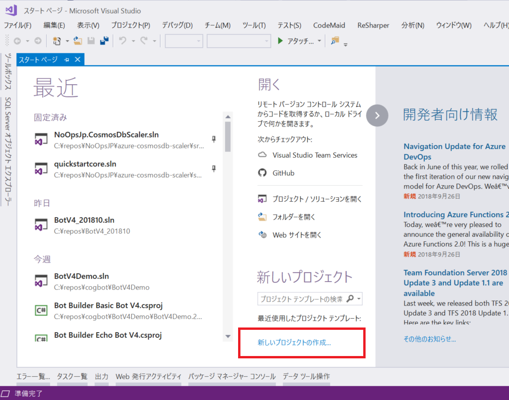
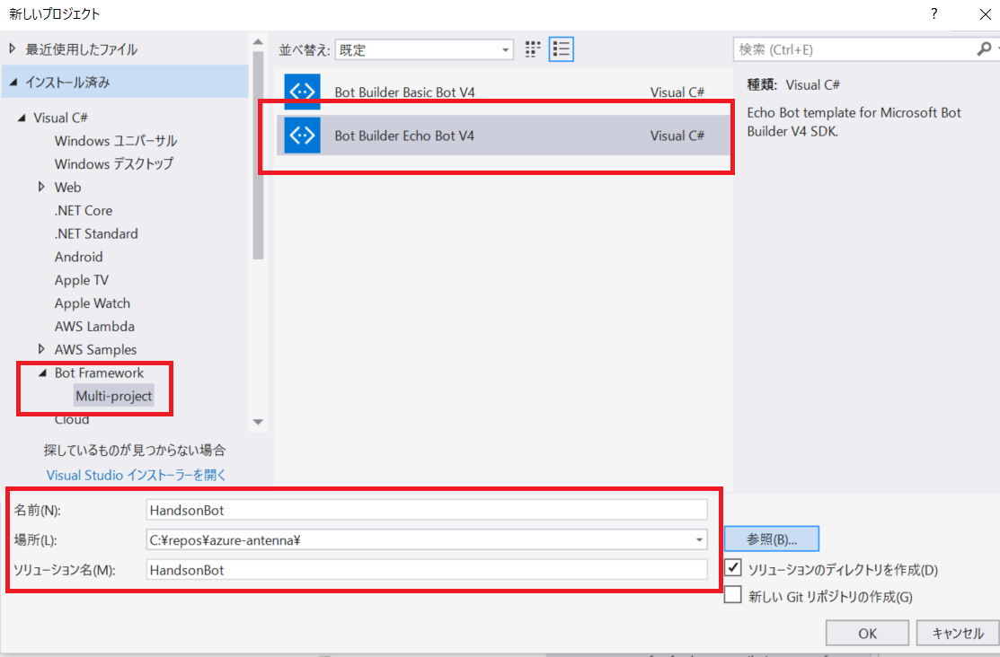
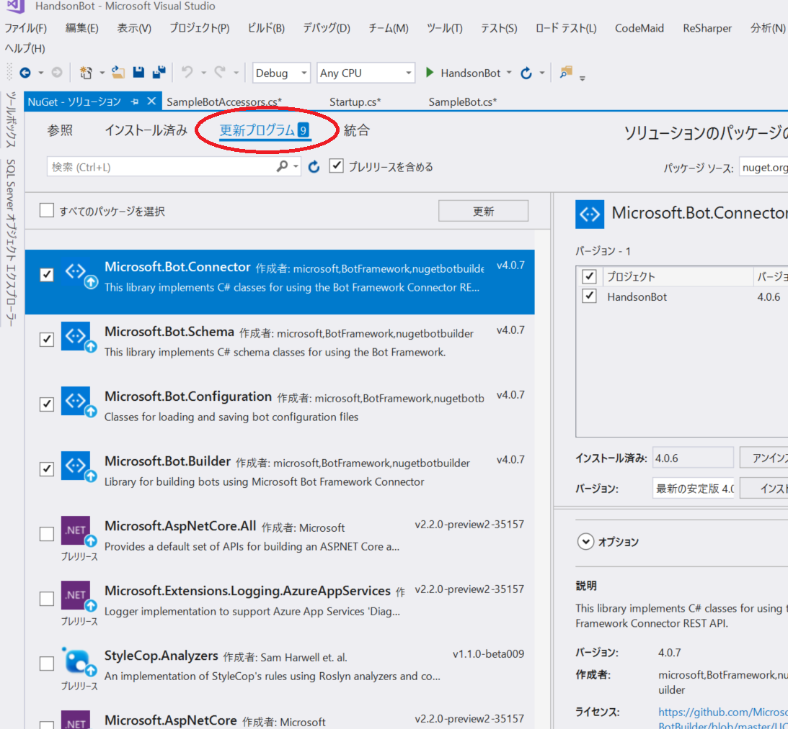
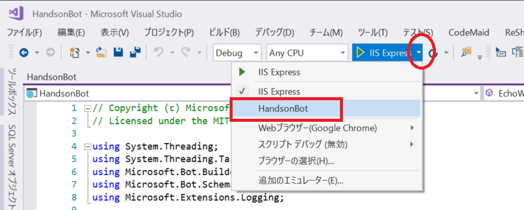
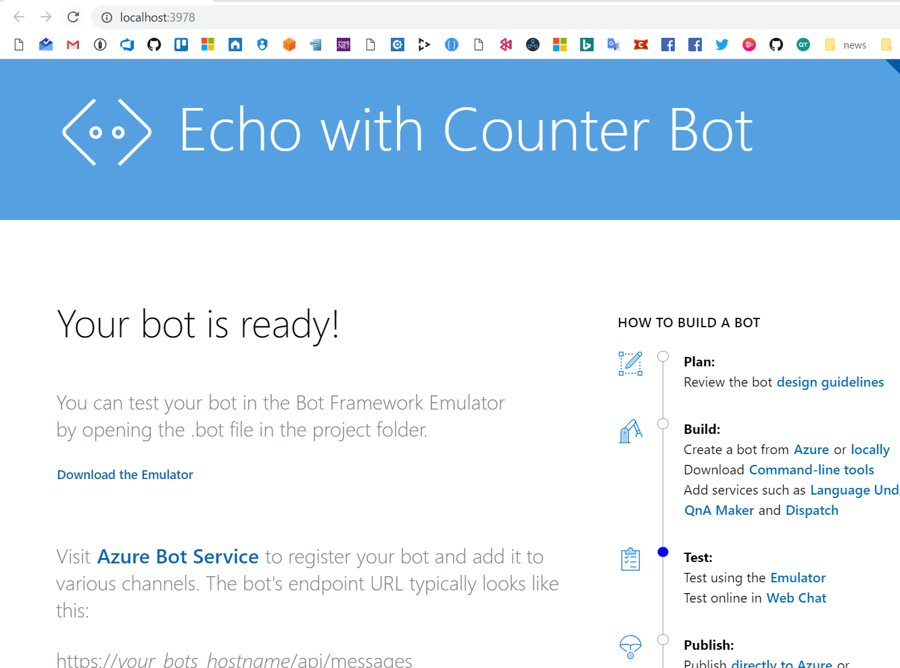
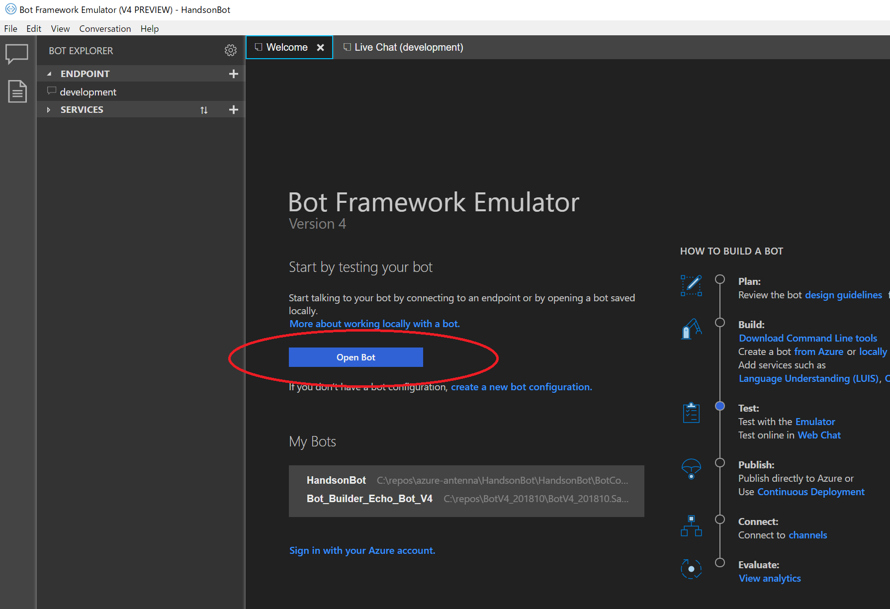
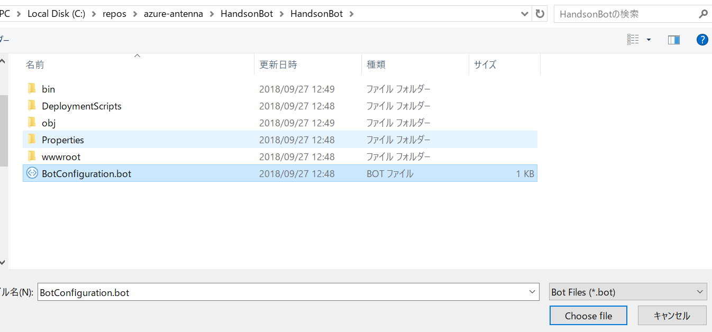

# 1. プロジェクトテンプレートからエコーボットの作成

プロジェクトを作成し、いくつかの主要なポイントを理解しましょう。

## プロジェクトの作成

Visual Studio f2017 を起動して、画面中央あたりの `新しいプロジェクト` をクリックします。

左ペインで、 BOt Framework > Muitl-project を選択し、中央で「Bot Builder Echo Bot V4」を選択します。
ウインドウ下部のプロジェクトの名前等は任意に入力してください。  
OK ボタンをクリックして、プロジェクトを作成します。

> 該当の項目がない場合、事前準備で「Bot Builder V4 SDK Template for Visual Studio」のセットアップに問題がある可能性があります。確認しましょう。

## Nuget パッケージのバージョン確認

VS 2017 の上部メニューの「ツール」 > 「Nuget パッケージ マネージャー」 > 「ソリューションの Nuget パッケージ の管理」を開きます。

「更新プログラム」タブをクリックし、「Microsoft.Bot....」から始まるパッケージは、**v4.0.7** である必要があります。必要なんパッケージを更新しましょう。

> 注意：他のパッケージは更新しないでください。

## プロジェクトの構成について

> ハンズオンにて、口頭で解説します。

## デバッグ実行

IIS Express ではなく、軽量の Kestrel でデバッグ実行をします。

画面上部の `IIS Express` の横にある「▼」をクリックし、プロジェクト名を選択します。

設定が完了したら、F5 キーでデバッグを開始します。正常に開始できると、以下の画面が表示されます。

## Bot Framework Emulator でアクセス

デバッグ実行ができたら、Enulator でアクセスしてみましょう。

Bot Framework Emulator を起動し、`Open Bot` をクリックします。

作成したプロジェクトの 「BotConfiguration.bot」ファイルを選択します。

Live Chat のタブで、メッセージを入力をし、エコーが返ってくることを確認しましょう。

> 接続できない場合は、事前準備で「ngrok のインストールとセットアップ」のセットアップに問題がある可能性があります。確認しましょう。

---

正常にデバッグできることが確認できたら、独自のボットを作成していきます。

[Back](00_Preparation.md) | [Next](02_WelcomeMessage.md)
