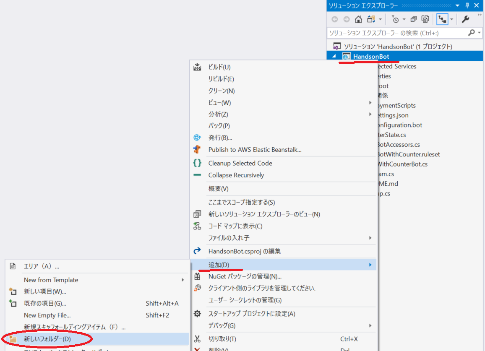

# ウェルカムメッセージの実装

ユーザーがボットにアクセスしたときに、ボットから挨拶をする実装を行います。

## シンプルなボットを作成

まず、この後ハンズオンの流れで利用するボットのクラスを作成します。

### SimpleBot クラスの実装

VS2017 にてプロジェクト名を右クリック > 「追加」 > 「新しいフォルダー」をクリックします。



フォルダー名は、「SampleBot」とします。

フォルダーを作成したら、フォルダーを右クリック > 「追加」 > 「クラス」を選択します。クラス名は「SimpleBot」とします。

実装は以下となります。

> コードの解説は、ハンズオンにて口頭でします。

```cs
using System.Threading;
using System.Threading.Tasks;
using Microsoft.Bot.Builder;
using Microsoft.Bot.Schema;
using Microsoft.Extensions.Logging;

namespace HandsonBot.SampleBot
{
    public class SampleBot : IBot
    {
        private const string WelcomeText = "SimpleBot へようこそ！";

        private readonly ILogger _logger;

        public SampleBot(ILoggerFactory loggerFactory)
        {
            _logger = loggerFactory.CreateLogger<SampleBot>();
            _logger.LogInformation("Start SimpleBot");
        }

        public async Task OnTurnAsync(ITurnContext turnContext, CancellationToken cancellationToken = default(CancellationToken))
        {
            if (turnContext.Activity.Type == ActivityTypes.Message)
            {
                // 通常のメッセージのやり取りはここで行います。
                await SendMessageActivityAsync(turnContext, cancellationToken);
            }
            else if (turnContext.Activity.Type == ActivityTypes.ConversationUpdate)
            {
                await SendWelcomeMessageAsync(turnContext, cancellationToken);
            }
            else
            {
                _logger.LogInformation($"passed:{turnContext.Activity.Type}");
            }
        }

        private static async Task SendWelcomeMessageAsync(ITurnContext turnContext, CancellationToken cancellationToken)
        {
            foreach (var member in turnContext.Activity.MembersAdded)
            {
                if (member.Id != turnContext.Activity.Recipient.Id)
                {
                    await turnContext.SendActivityAsync(WelcomeText, cancellationToken: cancellationToken);
                }
            }
        }

        private async Task SendMessageActivityAsync(ITurnContext turnContext, CancellationToken cancellationToken)
        {
            _logger.LogInformation($"passed:{turnContext.Activity.Type}");
        }

    }
}
```

### Startup.cs へ適用

この `SampleBot` クラスが呼び出されるように `Startup.cs` を変更します。

57 行目付近の以下コード

```cs
services.AddBot<EchoWithCounterBot>(options =>
```

を以下に変更します。

```cs
services.AddBot<SampleBot>(options =>
```

また、78 行目付近の以下コード

```cs
ILogger logger = _loggerFactory.CreateLogger<EchoWithCounterBot>();
```

を以下に変更します。

```cs
ILogger logger = _loggerFactory.CreateLogger<SampleBot>();
```

### Emulator で動作確認

デバッグ実行し、Emulator でアクセスしてみましょう。接続をし直すには、`StartOver` をクリックすると再接続します。


### ActivityTypes.ConversationUpdate について

> ハンズオンにて口頭で説明します。

---

次は、メッセージのやり取りの実装を行います。

[Back](01_Create_Project.md) | [Next](02_WelcomeMessage.md)
