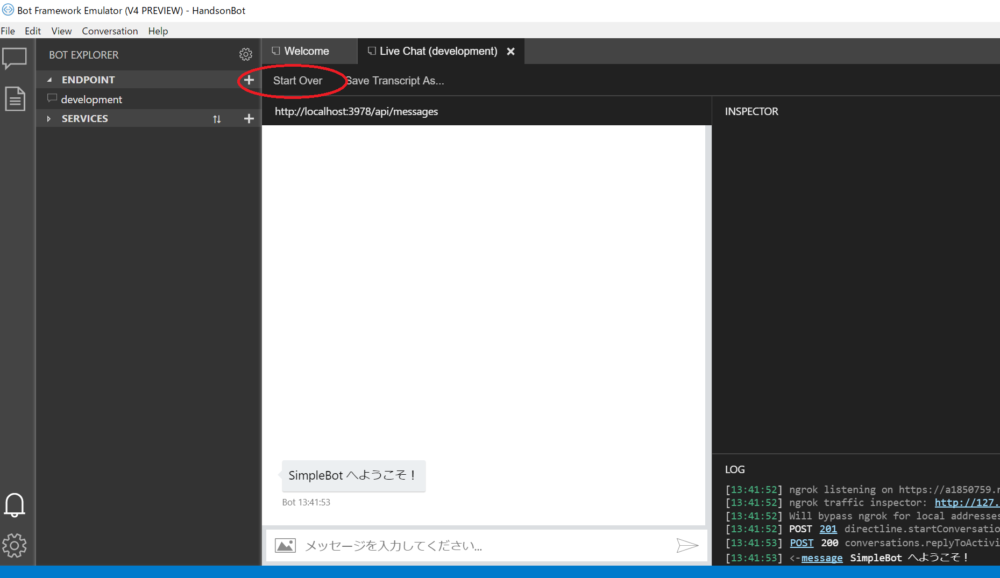

# 3. ステート管理

ボットのステートを管理するには、Bot Builder では主に 2 つのステートが用意されています。

- ConversationState
- UserState

> これらについての説明は、ハンズオンにて口頭で行います。

## UserState の実装

ユーザーがボットにアクセスしたときに、ボットがユーザーのハンドルネームを聞いて、覚えるようにしてみましょう。

### UserState のプロパティクラスの実装

ハンドルネームを格納するためのクラスを実装します。

「SampleBot」フォルダーを右クリック > 右クリック > 「追加」 > 「クラス」を選択します。クラス名は「UserProfile」とします。
実装は以下です。

```cs
namespace HandsonBot.SampleBot
{
    public class UserProfile
    {
        public string HandleName { get; set; }
    }
}
```

### Nuget パッケージ: Microsoft.Bot.Builder.Dialogs のインストール

まず、実装に必要な Nuget パッケージをインストールします。

VS 2017 の上部メニューの「ツール」 > 「Nuget パッケージ マネージャー」 > 「パッケージ マネージャー コンソール」を開き、以下のコマンドを実行してインストールを行います。

```cmd
Install-Package Microsoft.Bot.Builder.Dialogs
```



### ステート管理の Accessor の実装

「SampleBot」フォルダーを右クリック > 右クリック > 「追加」 > 「クラス」を選択します。クラス名は「SampleBotAccessors」とします。
実装は以下です。

> Bot Builder V4 では、Accesor という概念ができました。この概念と以下のコードの解説は、ハンズオンで、口頭説明をします。

```cs
using System;
using Microsoft.Bot.Builder;
using Microsoft.Bot.Builder.Dialogs;

namespace HandsonBot.SampleBot
{
    public class SampleBotAccessors
    {
        public IStatePropertyAccessor<DialogState> ConversationDialogState { get; set; }

        public IStatePropertyAccessor<UserProfile> UserProfile { get; set; }

        public ConversationState ConversationState { get; }

        public UserState UserState { get; }

        public SampleBotAccessors(ConversationState conversationState, UserState userState)
        {
            ConversationState = conversationState ?? throw new ArgumentNullException(nameof(conversationState));
            UserState = userState ?? throw new ArgumentException(nameof(userState));
        }
    }
}
```

### UserState クラスと SampleBotAccessors クラスの適用

`Starup.cs` でコードを変更する必要があります。

### UserState クラスの適用

UserState を初期化して利用できるようにします。

`Startup.cs` の 111 行目付近、

```cs
var conversationState = new ConversationState(dataStore);

options.State.Add(conversationState);
```

の部分を以下に変更します。

```cs
var conversationState = new ConversationState(dataStore);
options.State.Add(conversationState);

var userState = new UserState(dataStore);
options.State.Add(userState);
```

### SampleBotAccessors クラスの適用

`Startup.cs` の `ConfigureServices` メソッドの一番下に以下を実装しましょう。

> 説明は、ハンズオンにて口頭で行います。

なお、実装に合わせて `using` 句の追加は、必要に応じて行ってください。

```cs
services.AddSingleton<SampleBotAccessors>(sp =>
{
    var options = sp.GetRequiredService<IOptions<BotFrameworkOptions>>().Value
                    ?? throw new InvalidOperationException("BotFrameworkOptions must be configured prior to setting up the state accessors");


    var conversationState = options.State.OfType<ConversationState>().FirstOrDefault()
                            ?? throw new InvalidOperationException("ConversationState が ConfigureServices で設定されていません。");

    var userState = options.State.OfType<UserState>().FirstOrDefault()
                    ?? throw new InvalidOperationException("UserState が ConfigureServices で設定されていません。");

    var accessors = new SampleBotAccessors(conversationState, userState)
    {
        ConversationDialogState = conversationState.CreateProperty<DialogState>(nameof(DialogState)),
        UserProfile = userState.CreateProperty<UserProfile>(nameof(UserProfile)),
    };

    return accessors;
});
```

### SampleBotAccessors クラスを SampleBot クラスから利用する

SampleBot クラスから利用してみましょう。更新量が多いですが、意味を理解しながら進めると、単純ないようです。

> ハンズオンにて口頭で説明します。

```cs
using System;
using System.Threading;
using System.Threading.Tasks;
using Microsoft.Bot.Builder;
using Microsoft.Bot.Builder.Dialogs;
using Microsoft.Bot.Schema;
using Microsoft.Extensions.Logging;

namespace HandsonBot.SampleBot
{
    public class SampleBot : IBot
    {
        private const string WelcomeText = "SimpleBot へようこそ！";

        private readonly ILogger _logger;
        private readonly SampleBotAccessors _accessors; // Added
        private readonly DialogSet _dialogs; // Added

        public SampleBot(SampleBotAccessors accessors, ILoggerFactory loggerFactory) // Updated
        {
            _accessors = accessors ?? throw new ArgumentException(nameof(accessors)); // Added

            _dialogs = new DialogSet(accessors.ConversationDialogState); // Added
            _dialogs.Add(new TextPrompt("name")); // Added

            _logger = loggerFactory.CreateLogger<SampleBot>();
            _logger.LogInformation("Start SimpleBot");
        }

        public async Task OnTurnAsync(ITurnContext turnContext, CancellationToken cancellationToken = default(CancellationToken))
        {
            if (turnContext.Activity.Type == ActivityTypes.Message)
            {
                // 通常のメッセージのやり取りはここで行います。
                await SendMessageActivityAsync(turnContext, cancellationToken); // updated
            }
            else if (turnContext.Activity.Type == ActivityTypes.ConversationUpdate)
            {
                await SendWelcomeMessageAsync(turnContext, cancellationToken);
            }
            else
            {
                _logger.LogInformation($"passed:{turnContext.Activity.Type}");
            }

            await _accessors.ConversationState.SaveChangesAsync(turnContext, false, cancellationToken);
            await _accessors.UserState.SaveChangesAsync(turnContext, false, cancellationToken);
        }

        private static async Task SendWelcomeMessageAsync(ITurnContext turnContext, CancellationToken cancellationToken)
        {
            foreach (var member in turnContext.Activity.MembersAdded)
            {
                if (member.Id != turnContext.Activity.Recipient.Id)
                {
                    await turnContext.SendActivityAsync(WelcomeText, cancellationToken: cancellationToken);
                }
            }
        }

        // all updated
        private async Task SendMessageActivityAsync(ITurnContext turnContext, CancellationToken cancellationToken)
        {
            var dialogContext = await _dialogs.CreateContextAsync(turnContext, cancellationToken);
            var dialogTurnResult = await dialogContext.ContinueDialogAsync(cancellationToken);

            var userProfile = await _accessors.UserProfile.GetAsync(turnContext, () => new UserProfile(), cancellationToken);

            // ハンドルネームを UserState に未登録の場合
            if (userProfile.HandleName == null)
            {
                await GetHandleNameAsync(dialogContext, dialogTurnResult, userProfile, cancellationToken);
            }
            else
            {
                await turnContext.SendActivityAsync($"こんにちは、{userProfile.HandleName}", cancellationToken: cancellationToken);
            }
        }

        // added
        private async Task GetHandleNameAsync(DialogContext dialogContext, DialogTurnResult dialogTurnResult, UserProfile userProfile, CancellationToken cancellationToken)
        {
            if (dialogTurnResult.Status is DialogTurnStatus.Empty)
            {
                await dialogContext.PromptAsync(
                    "name",
                    new PromptOptions
                    {
                        Prompt = MessageFactory.Text("最初にハンドルネームを教えてください。"),
                        RetryPrompt = MessageFactory.Text("ハンドルネームは3文字以上入力してください。"),
                    },
                    cancellationToken);
            }
            else if (dialogTurnResult.Status is DialogTurnStatus.Complete)
            {
                // ハンドルネームを UserState に登録
                userProfile.HandleName = (string)dialogTurnResult.Result;
                _logger.LogInformation($"ハンドルネーム登録なう: {userProfile.HandleName}");
            }
        }
    }
}
```

### 入力のヴァリデーション

ハンドルネームは、今回は三文字以上というルールを設けて、ヴァリデーションと再入力を促すように実装してみましょう。

### ヴァリデーションをするメソッドの実装

まず、ヴァリデーションをするメソッドを `SampleBot` クラスに実装します。

```cs
public Task<bool> ValidateHandleNameAsync(PromptValidatorContext<string> promptContext, CancellationToken cancellationToken)
{
    var result = promptContext.Recognized.Value;

    if (result != null && result.Length >= 3)
    {
        var upperValue = result.ToUpperInvariant();
        promptContext.Recognized.Value = upperValue;
        return Task.FromResult(true);
    }

    return Task.FromResult(false);
}
```

### 特定のダイアログへ適用

コンストラクターで、

```cs
 _dialogs.Add(new TextPrompt("name"));
```

を以下のように変えます。

```cs
_dialogs.Add(new TextPrompt("name", ValidateHandleNameAsync));
```

デバッグ実行して、3 文字未満だと再入力が促されるか確認してみましょう。

---

次は、少し複雑な会話フローを実装します。

[Back](02_WelcomeMessage.md) | [Next](04_WaterfallSteps.md)
