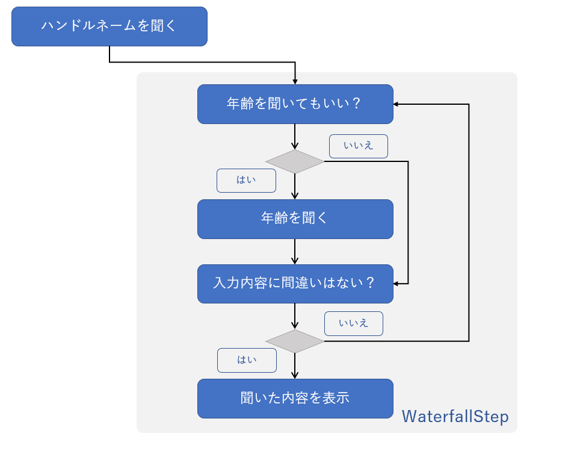

# 4. waterfallStep による会話フローの実装

## ボットの動作イメージ

改めて、実装する会話フローは、以下となっています。これをイメージしながら実装に進みましょう。



## waterfallStep について

連続で連なる waterfallStep は、どのステップがじっこうされているかを `ConversationDialogState` で管理しています。コードとしては、コンストラクターの

```cs
_dialogs.Add(...
```

の部分がそれに該当します。
そして、実際の動作は、 `WaterfallStep` クラスの配列と、`DialogContext` クラスのメソッドコールで制御されます。

## 年齢を UserProfile へ格納するあための準備

`UserProfile`クラスに、int 型の `Age` プロパティを実装しましょう。完成形は以下となります。

```cs
namespace HandsonBot.SampleBot
{
    public class UserProfile
    {
        public string HandleName { get; set; }
        public int Age { get; set; }
    }
}
```

## 各ステップの実装

waterfallSteps の個別のパーツをメソッドとして実装していきます。

### 年齢を聞いてもよいか確認

会話の返答は、「はい」「いいえ」のみを想定しますので、`ConfirmPrompt` を使います。
コンストラクターで以下のコードを追加します。

```cs
_dialogs.Add(new ConfirmPrompt("confirm"));
```

また、`SampleBot` に以下のメソッドを実装します。

```cs
private async Task<DialogTurnResult> ConfirmAgeStepAsync(WaterfallStepContext stepContext, CancellationToken cancellationToken)
{
    var userProfile = await _accessors.UserProfile.GetAsync(stepContext.Context, () => new UserProfile(), cancellationToken);

    return await stepContext.PromptAsync(
        "confirm",
        new PromptOptions
        {
            Prompt = MessageFactory.Text($"{userProfile.Name} さん、年齢を伺ってもよいですか？"),
            RetryPrompt = MessageFactory.Text("はい、または、いいえでお答えください。"),
        },
        cancellationToken);
}
```

### 年齢を聞く

年齢を聞いてよいと返答が来たら、実際に年齢を聞きましょう。
数値での回答を想定しているので `NumberPrompt` を利用します。コンストラクターで以下のコードを追加します。

```cs
 _dialogs.Add(new NumberPrompt<int>("age"));
```

ユーザーが年齢を答えてくれる場合は、年齢の入力を促します。
ユーザーが年齢を答えたくない場合は、年齢を「-1」として、ユーザーの回答を待たず次のステップに進みます。
これらの動作するために、`SampleBot` で以下のメソッドを実装します。

```cs
private async Task<DialogTurnResult> ExecuteAgeStepAsync(WaterfallStepContext stepContext, CancellationToken cancellationToken)
{
    if ((bool)stepContext.Result)
    {
        return await stepContext.PromptAsync(
            "age",
            new PromptOptions
            {
                Prompt = MessageFactory.Text("年齢を教えてください。"),
                RetryPrompt = MessageFactory.Text("年齢は数字で入力してください。"),
            },
            cancellationToken);
    }
    else
    {
        return await stepContext.NextAsync(-1, cancellationToken);
    }
}
```

### ユーザー入力の最終確認

会話の返答は、「はい」「いいえ」のみを想定しますので、`ConfirmPrompt` を使います。
コンストラクターでは、既に `ConfirmPrompt("confirm")` のダイアログのステート管理は追加済みです。

年齢に回答してくれた場合は、ユーザーが入力した年齢（または、-1）が取得できることが想定されます。
この動作のために、`SampleBot` に以下 2 つのメソッドを実装します。

```cs
private async Task<DialogTurnResult> ExecuteFinalConfirmStepAsync(WaterfallStepContext stepContext, CancellationToken cancellationToken)
{
    var userProfile = await _accessors.UserProfile.GetAsync(stepContext.Context, () => new UserProfile(), cancellationToken);
    userProfile.Age = (int)stepContext.Result;

    var message = GetAgeAcceptedMessage(userProfile);
    await stepContext.Context.SendActivityAsync(message, cancellationToken);

    return await stepContext.PromptAsync(
        "confirm",
        new PromptOptions { Prompt = MessageFactory.Text("登録情報は、これでよろしいですか。") },
        cancellationToken);
}
```

```cs
private static IActivity GetAgeAcceptedMessage(UserProfile userProfile)
{
    return MessageFactory.Text(userProfile.Age == -1 ? "年齢は非公開ですね。" : $"{userProfile.Age}才ですね。");
}
```

### 回答した結果を表示する

「ユーザー入力の最終確認」で、ユーザーが「はい」と回答した場合は、入力結果をボットで表示します。
ユーザーが「いいえ」と回答した場合は、この `WaterfallStep` を最初からやり直すように実装しています。
この動作のために、`SampleBot` に以下 2 つのメソッドを実装します。

```cs
private async Task<DialogTurnResult> ExecuteSummaryStepAsync(WaterfallStepContext stepContext, CancellationToken cancellationToken)
{
    if ((bool)stepContext.Result)
    {
        var userProfile = await _accessors.UserProfile.GetAsync(stepContext.Context, () => new UserProfile(), cancellationToken);
        var summaryMessages = GetSummaryMessages(userProfile);
        await stepContext.Context.SendActivitiesAsync(summaryMessages, cancellationToken);

        // detail ダイアログの終了
        return await stepContext.EndDialogAsync(cancellationToken: cancellationToken);
    }
    else
    {
        // details ダイアログをやり直す。
        await stepContext.Context.SendActivityAsync(MessageFactory.Text("もう一度お伺いします。"), cancellationToken);
        return await stepContext.ReplaceDialogAsync("details", cancellationToken: cancellationToken);
    }
}
```

```cs
private static IActivity[] GetSummaryMessages(UserProfile userProfile)
{
    IActivity summaryMessage = MessageFactory.Text(userProfile.Age == -1
        ? $"{userProfile.Name} 様、年齢は非公開ですね。"
        : $"{userProfile.Name} 様、年齢は {userProfile.Age}才ですね。");
    IActivity thanksMessage = MessageFactory.Text("ご入力ありがとうございました。");
    return new[] { summaryMessage, thanksMessage };
}
```

### waterfallStep のフローを実装

コンストラクターに waterfallStep の定義を実装します。コンストラクターの完成形は、以下になります。

```cs
public SampleBot(SampleBotAccessors accessors, ILoggerFactory loggerFactory)
{
    _accessors = accessors ?? throw new ArgumentException(nameof(accessors));
    _dialogs = new DialogSet(accessors.ConversationDialogState);

    var waterfallSteps = new WaterfallStep[]
    {
        ConfirmAgeStepAsync,
        ExecuteAgeStepAsync,
        ExecuteFinalConfirmStepAsync,
        ExecuteSummaryStepAsync,
    };

    _dialogs.Add(new TextPrompt("name", ValidateHandleNameAsync));
    _dialogs.Add(new ConfirmPrompt("confirm"));
    _dialogs.Add(new NumberPrompt<int>("age"));
    _dialogs.Add(new WaterfallDialog("details", waterfallSteps));

    _logger = loggerFactory.CreateLogger<SampleBot>();
    _logger.LogInformation("Start SampleBot");
}
```

### waterfallStep のフローの呼出しポイントを実装

最後に waterfallStep のフローが呼び出しを 2 箇所実装します。

1 つめは、ハンドルネームを登録する `GetHandleNameAsync` メソッドで、ハンドルネームを登録した直後です。`GetHandleNameAsync` の完成形は以下になります。

```cs
private async Task GetHandleNameAsync(DialogContext dialogContext, DialogTurnResult dialogTurnResult, UserProfile userProfile, CancellationToken cancellationToken)
{
    if (dialogTurnResult.Status is DialogTurnStatus.Empty)
    {
        await dialogContext.PromptAsync(
            "name",
            new PromptOptions
            {
                Prompt = MessageFactory.Text("最初にハンドルネームを教えてください。"),
                RetryPrompt = MessageFactory.Text("ハンドルネームは3文字以上入力してください。"),
            },
            cancellationToken);
    }

    // ハンドルネームを入力をした場合
    else if (dialogTurnResult.Status is DialogTurnStatus.Complete)
    {
        if (dialogTurnResult.Result != null)
        {
            // ハンドルネームを UserState に登録
            userProfile.Name = (string)dialogTurnResult.Result;
            await dialogContext.BeginDialogAsync("details", null, cancellationToken); // added
        }
    }
}
```

2 つめは、`SendConversationAsync` メソッドで、ハンドルネームが登録済み、かつ、ダイアログのステート（ `dialogTurnResult.Status` ）が `Empty` の時です。
`SendConversationAsync` の全体像は以下になります。

```cs
public async Task SendConversationAsync(ITurnContext turnContext, CancellationToken cancellationToken)
{
    var dialogContext = await _dialogs.CreateContextAsync(turnContext, cancellationToken);
    var dialogTurnResult = await dialogContext.ContinueDialogAsync(cancellationToken);

    var userProfile = await _accessors.UserProfile.GetAsync(turnContext, () => new UserProfile(), cancellationToken);

    // ハンドルネームを UserState に未登録の場合
    if (userProfile.Name == null)
    {
        await GetHandleNameAsync(dialogContext, dialogTurnResult, userProfile, cancellationToken);
    }

    // ハンドルネームを UserState に登録済みの場合
    else
    {
        // added
        if (dialogTurnResult.Status == DialogTurnStatus.Empty)
        {
            await dialogContext.BeginDialogAsync("details", null, cancellationToken);
        }
    }
}
```

デバッグ実行して、想定したフロー通りに動作するか確認してみましょう。

---

今回のハンズオンは、これで終了です。

[Back](03_Basic_State_Management.md) | [Summary](99_Summary.md)
